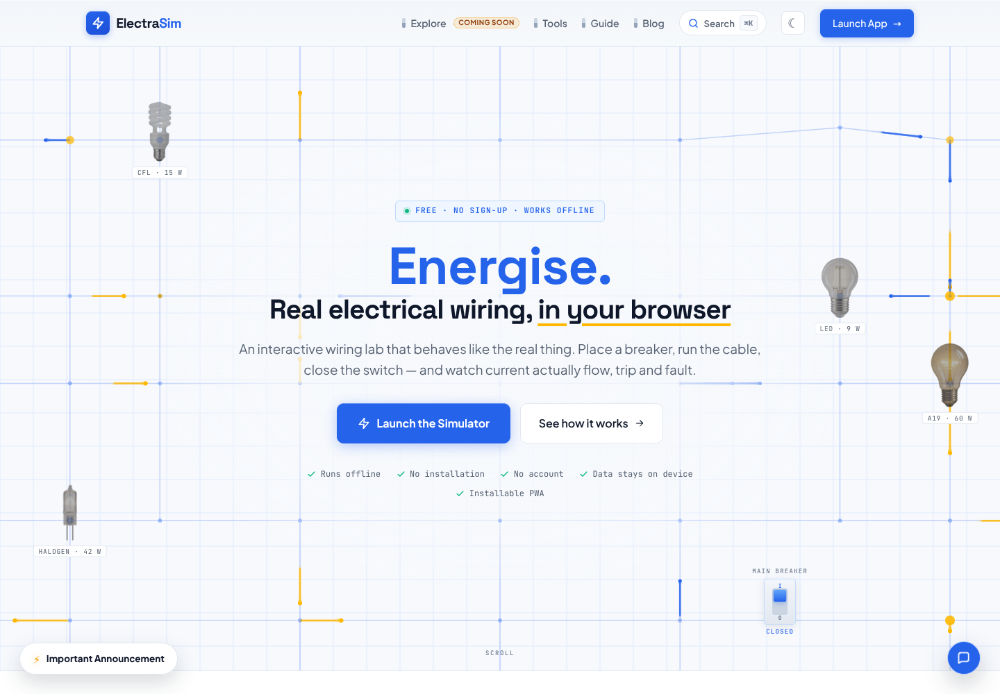
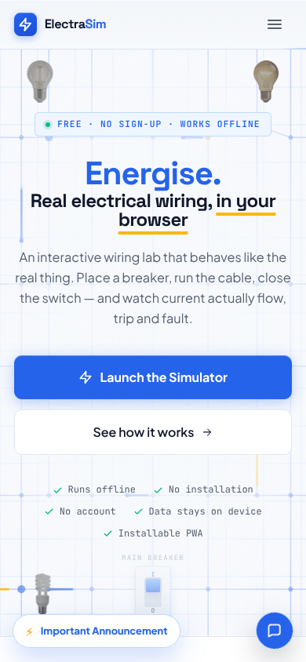
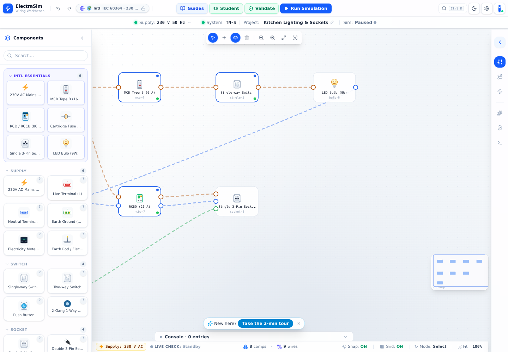
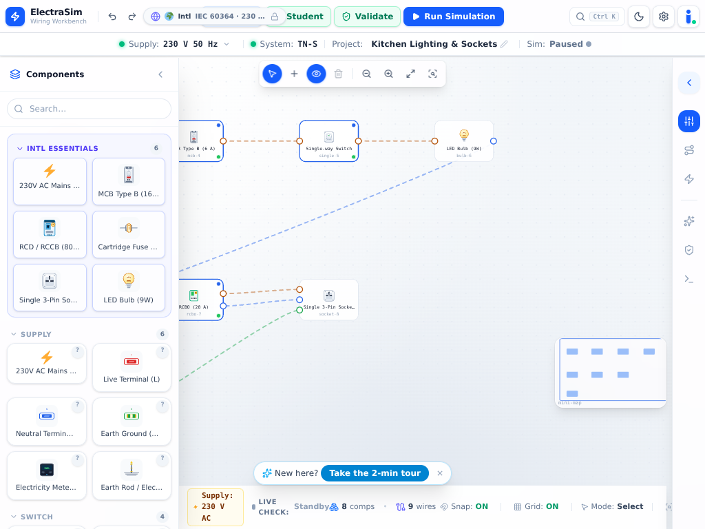
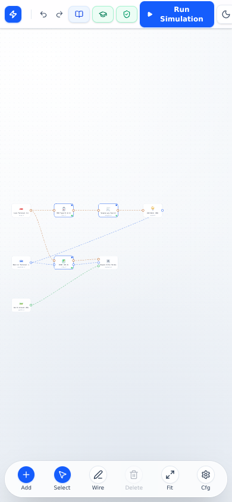
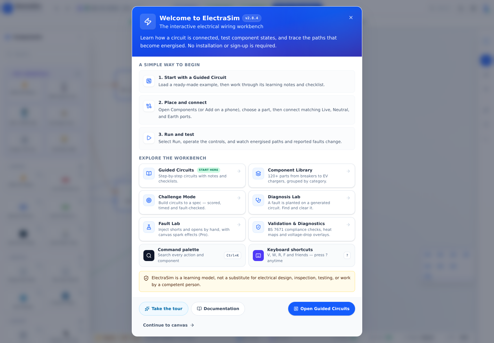
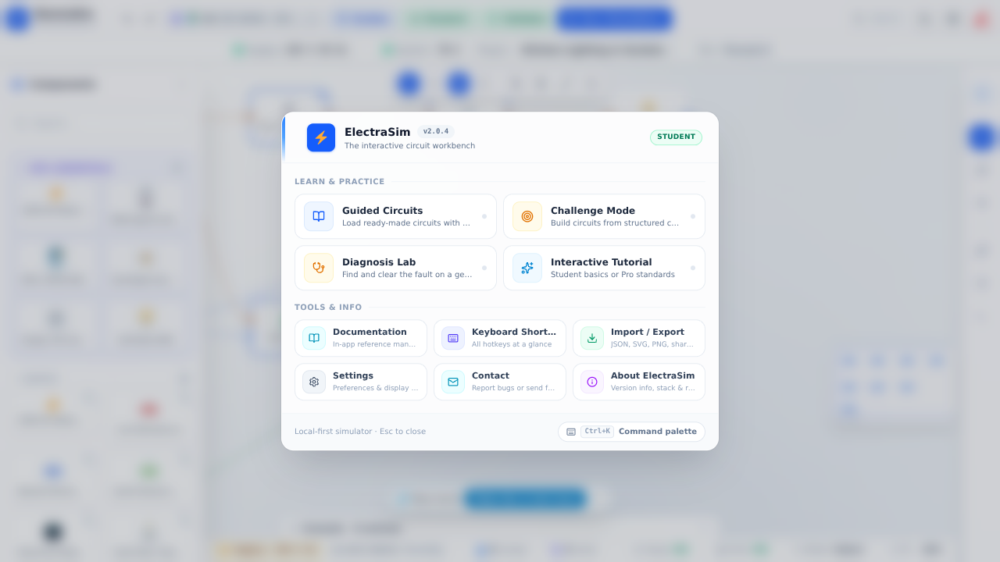

# ElectraSim v3 — Codebase and UX Audit

> **Audit date:** 2026-09-24
> **Repository:** `cngohar/electrasim-v3` at `e9673c8` plus the v3 planning changes
> **Purpose:** establish what v2 actually contains, what users currently see, what may be retained as behavior/content, and what must be redesigned for the v3 full rewrite.

## 1. Audit method

This was not based only on the README. The audit included:

- repository inventory and source-size analysis;
- review of the application composition root, editor shell, toolbar, canvas, palette, inspector, stores, persistence, import/export, worker boundary, electrical model, validation, standards, guided circuits, challenge generator, diagnosis modes, and Astro routes;
- dependency and network/backend searches;
- Chromium visual review at 1440×1000, 1024×768, and 390×844;
- first-visit, command-hub, marketing-home, desktop editor, tablet editor, and phone editor captures;
- automated verification with TypeScript, Biome, and Vitest;
- web research covering progressive disclosure, WCAG 2.2 interaction requirements, learning-dashboard cognitive load, and common circuit-simulator interaction patterns.

### Verification result

| Check | Result |
|---|---|
| `npm run typecheck` | Passed, including Astro workspace |
| `npm run lint` | Passed; 547 files checked |
| `npm test -- --reporter=dot` | Passed; 97 files and 1,464 tests |
| Production dependency audit | No production vulnerabilities reported by `npm audit --omit=dev` |
| Full install audit | 12 development/transitive findings reported (5 moderate, 6 high, 1 critical); triage is required even though none are in the production-only tree |
| Playwright/Chromium console errors during reviewed screens | None |

The standard Playwright browser CDN was unavailable from the environment. Chromium was therefore obtained from the npm registry through `@sparticuz/chromium`, its packaged runtime libraries were extracted, and Playwright drove that binary. This dependency was installed with `--no-save` and is not proposed as a product dependency.

## 2. Repository inventory

| Area | Observed size/content |
|---|---|
| Simulator `src/` | Approximately 75,754 TypeScript/TSX/CSS lines; 371 files including assets |
| Astro site `astro-site/src/` | Approximately 63,776 lines; about 250 files |
| Component registry | Approximately 102 concrete component entries found in source |
| Guided circuits | 20 authored templates |
| Procedural generator | 12 topology recipes, three difficulty profiles, deterministic seeds |
| Fault registry | 14 injected fault definitions |
| Published blog content | 69 posts |
| App E2E suite | 16 Playwright spec files spanning editor, faults, guides, challenges, tools, mobile, production, and performance |

There is a copy inconsistency already visible to users: the website claims “115+” components and the welcome screen claims “120+”, while a direct registry inventory found roughly 102 concrete entries under the registry pattern. v3 must calculate public product counts from source data instead of hand-maintaining claims.

## 3. Current architecture

### 3.1 Product surfaces

v2 is two applications merged into one static deployment:

1. **React/Vite simulator SPA** under `/app/`.
2. **Astro static marketing/content site** for the homepage, guides, glossary, blog, updates, comparison bench, cable sizing, and voltage drop tools.

The simulator has no route system and no product shell beyond the editor. `App.tsx` renders only an error boundary and `Editor`. There are no account, dashboard, LMS, community, billing, or administration routes.

### 3.2 Simulator composition

The simulator uses:

- React 19 and TypeScript;
- Zustand + Immer for state;
- zundo for a bounded 100-step graph history;
- SVG for the production canvas;
- a Comlink Web Worker for simulation with main-thread fallback;
- IndexedDB through `idb-keyval` for one local circuit and preferences;
- lazy-loaded overlays for guides, challenges, diagnosis, docs, settings, import/export, and validation detail;
- Workbox/Vite PWA support.

The editor composition root coordinates more than 25 persistent or conditional surfaces. This is feature-rich but creates a large UI orchestration point and makes the editor itself the entire product.

### 3.3 Electrical model

The domain is framework-independent and defines:

- components, ports, wires, geometry, component state, fault state, and circuit state;
- three conductor port kinds: `live`, `neutral`, and `earth`;
- traversal-based energized paths;
- load power/current calculations;
- MCB/RCD trip calculations;
- faults, protection propagation, thermal/cable behavior, voltage drop, validation, and compliance messaging;
- UK, US, EU, and generic international presets;
- regional plug/socket filtering independent from electrical standard.

This is a strong separation boundary, but it is an educational graph simulator rather than a general circuit-analysis kernel. Three-phase components are represented through the same broad `live` port type rather than explicit L1/L2/L3 phase identities. Advanced v3 claims therefore require a new mathematical specification, not only a prettier renderer.

### 3.4 Learning modes

v2 already provides useful foundations:

- 20 guided circuit templates;
- declarative build challenges;
- deterministic procedural generation;
- Challenge Mode;
- Diagnosis Lab;
- Ohmageddon difficulty modifiers;
- seeded replay/share behavior;
- scoring, hints, attempt persistence, and challenge workspace restoration.

The generator is pure and bounded. It validates structure, electrical rules, circuit validation, simulation in basic and Pro modes, and expected energized loads. This is valuable behavior to capture in v3 fixtures.

Important constraints found in source:

- generation currently hardcodes `globalVoltage: 230`;
- generated candidate compliance is validated with `'uk'` regardless of selected user standard;
- generator identity does not yet carry standard/catalog/rubric versions required for formal exams;
- “challenge”, “diagnosis”, and “rage” are identity inputs, while mode-specific behavior is layered elsewhere;
- current validation is suitable for practice content, not yet evidence of equivalent-difficulty high-stakes exam items.

### 3.5 Persistence and import/export

Current persistence is local and intentionally single-document:

- one IndexedDB circuit key;
- one settings profile;
- separate local challenge/diagnosis state;
- no cloud project list, ownership, sharing ACL, sync, conflict resolution, or immutable submission snapshot.

The JSON format has useful protections: byte limits, component/wire limits, finite coordinate checks, ID checks, port bounds, known component types, compatible conductors, and prototype-key sanitization.

A schema-drift risk exists: the domain state has grown fields such as `rcdType`, `batteryChemistry`, `groupId`, and `autoLabel`, while the import validator uses a strict field allowlist that does not visibly cover every current optional state field. Wire fault validation also accepts a narrower subset than the domain type. v3 must generate runtime validators from one versioned schema instead of manually duplicating it.

### 3.6 Backend and platform features

The source search found no application backend or persisted network API for product data. There is currently:

- no authentication;
- no user database;
- no PostgreSQL;
- no RBAC or tenant policy engine;
- no institutions, courses, enrollment, assignments, gradebook, or LMS analytics;
- no community graph or public account profiles;
- no subscription/entitlement enforcement;
- no payment/order/webhook system.

“Student” and “Pro” are currently a local preference toggle. They filter or expose features but are not identities, roles, plans, or paid entitlements. Existing marketing also promises all features are free with no account. v3 changes the product contract and requires coordinated copy, legal, onboarding, and migration—not merely technical gating.

## 4. Current UI observed in Chromium

### 4.1 Marketing homepage

Strengths:

- distinct electrical visual identity;
- clear primary simulator CTA;
- responsive mobile hero;
- strong typography and whitespace;
- trust cues for offline/no account behavior;
- interactive visual metaphor connected to the product.

Problems for v3:

- a blocking first-visit “development temporarily paused” modal obscures the product;
- hero copy promises no signup, full free access, local-only data, and an app-only product, conflicting with v3 accounts, cloud data, LMS, social, and Pro plans;
- navigation has no Learn, Community, Pricing, Institution, or Dashboard destination;
- “Explore” is marked coming soon even though v3 needs it to become a real discovery/community surface;
- the hero is product-centric but not role-aware; an instructor cannot immediately find institution value;
- procedural homepage variation currently cycles words/visual state but is not a reusable, versioned composition engine.

Mobile capture:

### 4.2 Desktop editor

What users see:

- full-width top command bar with brand, undo/redo, standard, Guides, Student/Pro, Validate, Run, search, theme, settings, and menu;
- second context bar with supply, earthing system, project name, and simulation state;
- large left component catalog with search, essentials, categories, and tile grid;
- floating canvas toolbar;
- central SVG workbench with components, wires, minimap, tour invitation, console drawer, and bottom status bar;
- collapsed right inspector rail with properties, connections, simulation, analytics, validation, logs, and Pro features.

Strengths:

- power-user capabilities are discoverable;
- editor has clear wire colors and direct manipulation;
- persistent status and simulation controls;
- inspector separates selected-object details from the canvas;
- command palette and shortcuts support experts;
- desktop uses available space well for a standalone editor.

Problems:

- too many equally weighted controls compete in the top 84 pixels;
- global app actions, electrical-standard choices, learning modes, diagnostics, project state, and selected-object actions are mixed together;
- “Student/Pro” is a mode switch in the primary command row, but in v3 plan level and user role must not be treated as editor modes;
- the right rail relies heavily on unlabeled icons;
- component cards truncate names and depend on tiny imagery;
- orange, blue, green, purple, and status dots all carry meaning simultaneously, increasing visual decoding cost;
- the console, status bar, tour chip, minimap, floating toolbar, left palette, and right rail can all be present at once;
- the editor has no visible project breadcrumb, save/sync state, ownership/share state, assignment context, attempt context, or route back to the platform;
- validation and simulation are separate primary actions without a simple beginner mental model explaining when to use each;
- exact component claims and standards messaging are embedded in UI text rather than sourced from catalog metadata.

Tablet capture:

At 1024 px, the palette consumes about one quarter of the width and the top bar begins dropping actions. The circuit automatically appears smaller, while the same interaction density remains.

### 4.3 Phone editor

The phone layout replaces desktop panels with a six-item bottom dock, but:

- the circuit opens extremely small relative to the viewport;
- the top command row is clipped to icons and the large Run button;
- the visible state gives little orientation or project context;
- the inspector is completely absent on phones;
- advanced wiring and port selection are technically available but visually difficult;
- the first visit shows a modal warning that the app is better on a larger screen, then shows another long welcome surface;
- the phone welcome content requires substantial scrolling before the primary “start” outcome.

For v3, phone should support dashboards, lessons, community, grade review, simple games, and viewing circuits well. The complete professional editor should be tablet/desktop optimized rather than claiming identical usability on every screen.

### 4.4 First-run and command surfaces

The welcome screen accurately lists features but front-loads a large amount of product explanation before the user has context. Contextual onboarding should replace most of it.

The command hub is well grouped, but it is another modal catalog over an already control-dense editor. In v3, top-level navigation belongs in the platform shell. The command palette should remain for expert actions; the menu should not be the primary way to discover core product areas.

## 5. UX research applied

The redesign uses these externally validated principles:

- Nielsen Norman Group’s progressive disclosure guidance: show frequent primary actions and defer advanced options to a secondary layer, generally avoiding more than two disclosure levels.
- WCAG 2.2: dragging must have a non-drag alternative; targets need adequate minimum size/spacing; focus must remain visible and unobscured; authentication must avoid cognitive-function tests.
- Learning-dashboard research: simple, low-inference visuals are more useful when paired with an actionable explanation; metric-only dashboards can add cognitive load without improving outcomes.
- Circuit-simulator patterns: direct manipulation, immediate simulation feedback, animated current/state, probes/instruments, examples, and shareable circuits are useful; professional analysis should not overwhelm first-time learners.

Primary sources are linked in the master plan references.

## 6. What should be retained

Retain as requirements and test evidence, not blindly copied implementation:

- circuit fixtures and expected behavior;
- trip-curve and electrical-calculation tests after SME review;
- deterministic seed and bounded-generation concepts;
- 20 guided-circuit learning narratives;
- challenge/diagnosis scoring concepts;
- component and fault taxonomy;
- standards/tool calculation content after citation review;
- import validation threat cases;
- keyboard, accessibility, production-header, offline, and performance test scenarios;
- authored blog, guide, glossary, and update content that passes current editorial review;
- visual brand assets with clear licensing/provenance.

## 7. What should be rewritten

- application shell, routing, dashboards, and all account-aware UI;
- editor orchestration and responsive layout;
- circuit schema and runtime validation;
- electrical kernel where fidelity requirements exceed current graph traversal;
- standards abstraction and phase/conductor model;
- cloud project/revision persistence;
- generator manifest, standard awareness, exam equivalence, and reserve-pool service;
- local Student/Pro toggle, replaced by learning experience modes plus server entitlements;
- all authentication, RBAC, LMS, community, billing, and moderation modules;
- public homepage copy and navigation;
- first-run onboarding.

## 8. Critical rewrite risks

| Risk | Evidence | v3 response |
|---|---|---|
| Scope explosion | Current product is already ~140k source/content lines before platform features | Stage vertical slices; modular monolith; explicit first release |
| Product-contract conflict | v2 promises free/no account/all unlocked | Migration communication and truthful plan matrix before beta |
| Domain overclaim | Current engine is educational traversal/approximation | Fidelity labels, SME specification, golden/property tests |
| Standards inconsistency | Generator hardcodes 230 V and UK validation | Standard/catalog version in every generation request/manifest |
| Schema drift | Domain state and hand-written import validator can diverge | One schema source generating TS, DB/API, and runtime validators |
| Dense editor UX | Two headers plus palette, rail, minimap, console, status, tour | Task modes and progressive disclosure |
| Weak phone editor | Tiny initial circuit and absent inspector | Phone viewing/simple games; full editor optimized for larger screens |
| Tenant leakage | No current tenant model exists | Tenant IDs, central policy engine, RLS defense, IDOR tests from foundation |
| High-stakes fairness | Determinism is not equivalent difficulty | Blueprint metrics, pilot calibration, immutable generated instances |
| Social/minor safety | No current identity or moderation | Age decision, private defaults, moderation staffing before community launch |

## 9. Audit conclusion

v2 is not a trivial prototype. It contains a substantial local-first simulator, learning content, deterministic challenge foundations, polished marketing, and unusually broad automated coverage. Those assets reduce discovery risk, but they do not reduce the backend, tenancy, LMS, community, commerce, and account work into a normal feature release.

The correct v3 strategy is:

1. treat v2 behavior/content as a reference corpus;
2. establish a new product shell and versioned domain contracts;
3. ship a focused simulator + account + personal dashboard vertical slice;
4. add LMS workflows on the same contracts;
5. add games/gamification and procedural assessment only after server-authoritative evidence exists;
6. add community and payments only with moderation/legal/operations readiness.

The accompanying [`../../PLAN.md`](../../PLAN.md) converts these findings into the user-visible v3 experience and implementation roadmap.
